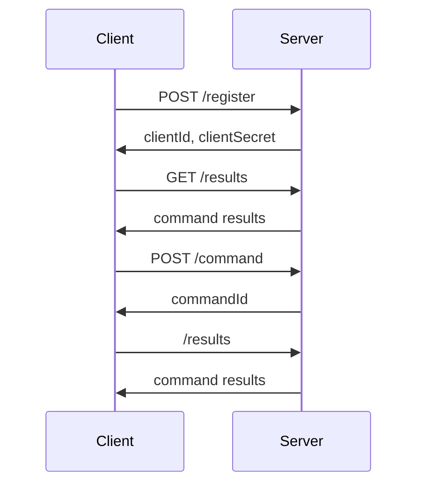

# Server API

The server provides a simple REST-like (JSON-over-HTTP) interface for clients.

> Note: the structure and event-driven style of the system were intended to allow for
> a future socket-based API in addition to the one described below.
 
The typical flow for a client is to register, poll for data, and then issue commands as controls are used.




## Register
`POST /register` allows a client to register with the server.

The server returns a unique `clientId` which is used to identify that specific client.
That ID can be used when issuing commands to the server for things like specifying what screen is being displayed or to put the client into a "SYSTEM OFFLINE" mode.

Registering also returns a `clientSecret` which is required to send commands to the server.

> Note: some form of authentication or authorization check could be added here to prevent unauthorized clients from registering.


## Issue Command
`POST /command` is used to send a command to the server.

The request body contains:
* `clientSecret` - the secret the client obtained when registering.
* `type` - what kind of command is being issued.
* `payload` - the data needed for this specific command type.

The response contains a `commandId` which can be used to track the results of this specific command
(useful primarily for debugging).

An example command:
```json
{
  "clientSecret":"7XV9Mtt0Aa50kcImPcN5OA44WcHBMHu6IIoCQonSAWg=",
  "type":"set-thrusters-attitude",
  "payload":{
    "yaw":15,
    "pitch":355,
    "roll":0
  }
}
```

> Note: currently there is not a good way to discover what command types are available or what the payload should look like.
> In the future it would be nice if each system could provide examples or documentation, but for now you have to look at the code.
> For an example, see the `ThrustersSystem` class.

> Note: at some future point, a command might need to specify which ship system is being targeted.
> For example if there are multiple different types of engine systems.


## Get Simulation State via Command Results

`GET /results?cursor={cursor}` returns the results of the various commands that the server has processed.

Instead of being able to ask for the current simulation state, the server returns the results of each command
along with what system was affected and the resulting state of that system.

This provides a number of useful benefits:
* Developers don't have to learn a complex API to get data. 
  They can easily build up the current state based on the latest data for each system.
* Clients have access to how things have changed over time, not just the current state.
  For example, it could draw a graph of engine heat over time or count how often weapons are fired.
* The results can be examined for debugging purposes.
* This format may be easier to translate to an additional socket-based API in the future,
  allowing clients to get the data over a different mechanism but process it in similar ways.

But there are also some downsides:
* You cannot get the current state without going through all the relevant results.
* There are cases where a system does not report its full state on every update.
  For example, a long sensor scan answer might only show up once when the scan is completed.
  So the client has to look for cases like these and store the results if they will be needed later.

The endpoint returns a `results` array and a `nextCursor` value.
When you call the endpoint the first time, no cursor is provided.
But the client sends the last `nextCursor` value it received to get the next batch of results.
This also means that the client can easily start over and get results from the beginning.

[Here is some example client code](./client-data-handling.md) to illustrate how this data can be used.
You can also look at the [dev-client](../dev-client/README.md) code for working examples.

Example result:
```json
{
    "rowId": 424,
    "commandResultId": "ecc8bd47-8098-42ab-baa3-52c267fa7346",
    "type": "state-updated",
    "commandId": "26c6ae16-115e-4332-ba2a-6fb141cc1f61",
    "clientId": "00000000-0000-0000-0000-000000000000",
    "system": "sublight-engines",
    "payload": {
        "currentSpeed": 0,
        "speedConfig": {
            "maxSpeed": 5,
            "cruisingSpeed": 3
        },
        "currentHeat": 963,
        "heatConfig": {
            "poweredHeat": 1000,
            "cruisingHeat": 3000,
            "maxHeat": 5000,
            "minutesAtMaxSpeed": 10,
            "minutesToCoolDown": 20
        },
        "speedPowerRequirements": [
            {
                "speed": 5,
                "powerNeeded": 8
            }
        ],
        "currentPower": 5,
        "requiredPower": 5,
        "disabled": false,
        "damaged": false
    },
    "timestamp": "2025-02-04T22:18:19.567916+00:00"
}
```

Some example error results:

```json
{
    "rowId": 253,
    "commandResultId": "e542d55a-ec48-4acc-9d03-96977c65c25b",
    "type": "error",
    "commandId": "e363c2d5-e5d3-4193-96a7-85c6cd115b1e",
    "clientId": "08059b35-c472-4839-be9a-21c2e7b730f2",
    "system": "alert",
    "payload": "There is no defined alert level 4",
    "timestamp": "2025-02-04T22:16:15.417765+00:00"
}
```

```json
{
  "clientId": "08059b35-c472-4839-be9a-21c2e7b730f2",
  "commandId": "cbee59ad-de69-4548-8393-419d52d1acbf",
  "commandResultId": "59da2ba8-b57f-4238-9fe3-f4edd3295770",
  "payload": "Could not parse command payload from JSON",
  "rowId": 476,
  "system": "unknown",
  "timestamp": "2025-02-04T22:24:53.01227+00:00",
  "type": "error"
}
```

> Note: it might be nice to add some filtering options here to only get results for a subset of systems that the client cares about.
