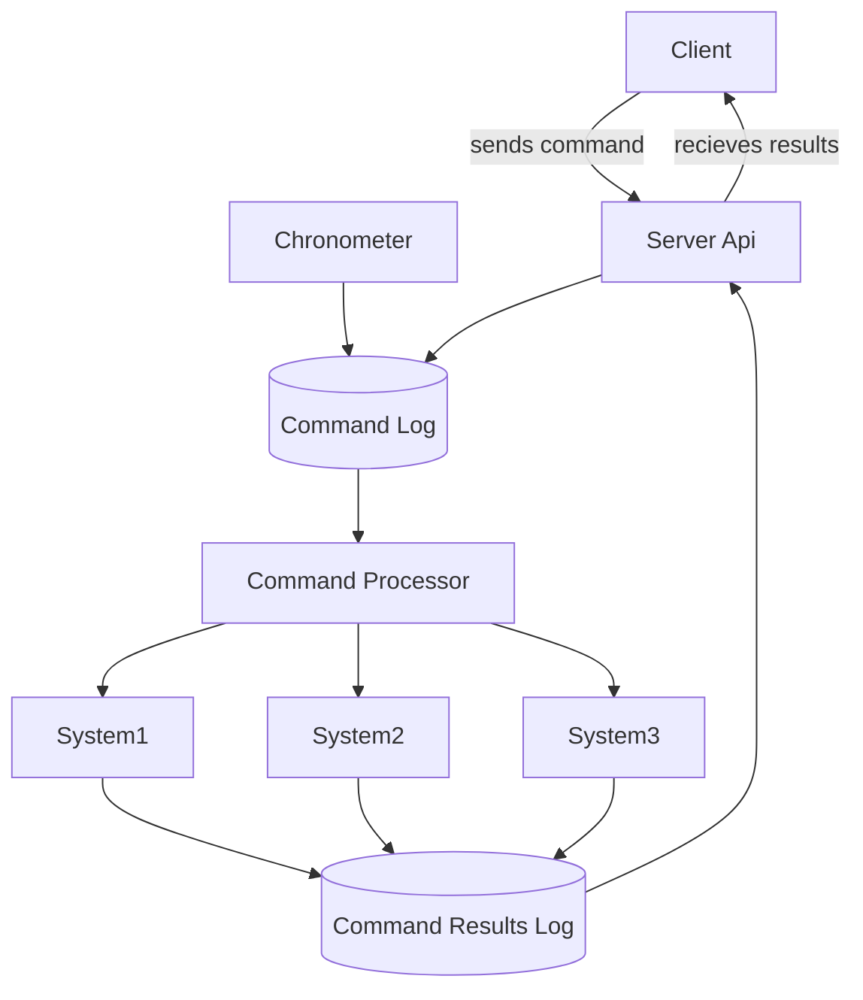

# OpenStardrive Server Overview

The OpenStardrive server is responsible for managing the state of the simulation.
It:
* Provides an [API](./api.md) for clients to register, issue commands, and view command results which carry system state.
* Processes input commands, updating the simulation state, and recording command results.
* Provides a registry of ship systems (e.g. thrusters, sensors, alert level etc.).

This prototype server was used to explore an event-sourced model for managing the simulation state.
It is designed to be run locally, not behind a load balancer, due to how it keeps system state in memory.
It also makes heavy use of immutable state and the "maybe" monad (concepts from functional programming).
The event logs are stored in an SQLite database.
The code was written w/ a test-driven approach.

The intent is for a variety of clients to be able to connect to the server and all interact w/ the simulation state.
Some clients would be crew stations while others are staff controls (e.g. the Flight Director).
The main viewscreen could be another client.
Other clients might control lighting or sound effects, or could connect to engineering panel circuitry.

## Command Processing

When a command is issued to the server, it is immediately stored in an event log for later processing.

The server continually reads from the event log of commands, processing them in the order they were recorded.
For every command:
1. The command is passed to each system which has registered for that type of command.
2. Each system updates its state (if applicable) and returns a _command result_. This result can indicate:
   * That the state was updated (and the command includes a copy of the updated system state).
   * That an error occurred.
   * That the command was accepted, but did not change the system state.
3. If no systems were registered for the command, an "unrecognized" command result is returned.
4. Command results are written to a second event log, except for those which indicated no change in system state.
   (This is to avoid filling the event log with duplicate, non-useful events.)

Clients use the server's API to receive the command results with the attached system states.

The server also records "chronometer" commands to the event log approximately once per second.
Systems can process these to update time-based changes, like altering engine heat or moving sensor contacts.

An illustration of the data flow:

### Server Startup

When the server starts up, it creates a new SQLite database if needed.
If there is already one there, it drops the command result event log table and recreates and empty version.
Then all commands are processed as usual.

This allows the server to rebuild the simulation state after a restart (or crash).
At some future point it might be nice to preserve the command results across restarts,
but as a prototype it was easier to start fresh each time and reprocess valid commands after bug fixes to see the new result.

Each flight would have its own database, starting from a clean slate.
Databases files could be preserved for later analysis or debugging.

### Client Handling

[Here is some example client code](./client-data-handling.md) that shows how clients can utilize
command results from the [API](./api.md).
You can also look at the [dev-client](../dev-client/README.md) code for working examples.

## Ship Systems

Each ship system is defined by a name, state, and a set of command processors.
The command processors typically delegate to a set of "transforms" which contain all the logic for updating state,
including validation and checking for things like sufficient power.

A simple example is the `AlertSystem` which only tracks the current alert level (i.e. Red Alert).
It only processes 3 command types:
* `report-state` returns the current state (this command is automatically issued to all systems when the server starts so the initial state is available).
* `configure-alert-levels` allows a client to configure what levels are available.
* `set-alert-level` changes the alert level.

If one system needs to know about another system, it can access state via the `SystemsRegistry`.
An example of this can be found in the `NavigationTransforms` where current engine speed is used to determine an ETA.

Although each system defines its own state, there is a `StandardSystemBaseState` which defines
common properties like damaged / disabled state and power requirements.
There is a corresponding set of `StandardTransforms` which make it easy to process the commands for these properties. 

> Note: currently, any class implementing the `ISystem` interface is automatically registered on startup.
> At some future point this could be made configurable or be able to read from other assemblies.
